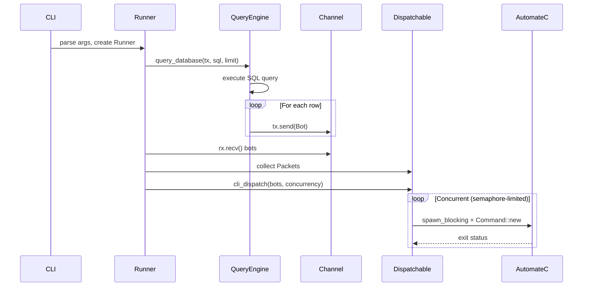

# Architecture

This document describes the internal architecture of BulkRunner.rs for contributing developers.

## Crate Overview

```
bulk_runner.rs/
├── crates/
│   ├── bulk_runner_rs/      # Main binary, CLI parsing, orchestration
│   ├── bulk_runner_bots/    # Bot types, status enums, dispatch execution
│   └── bulk_runner_query/   # Database connectivity, SQL execution, command building
└── Cargo.toml               # Workspace configuration
```

### bulk_runner_rs (Main binary crate)

The entry point and orchestration layer:

- **CLI parsing** - Command-line argument handling via clap
- **Runner** - Coordinates the query → transform → dispatch pipeline
- **Packets** - Groups bots with process names for dispatch

### bulk_runner_bots

Bot domain model and dispatch execution:

- **Bot/BaseBot** - Resource representation with status
- **BotStatus** - Ready/NotReady state machine
- **Dispatch** - Executes AutomateC subprocess

### bulk_runner_query

Database and external system integration:

- **QueryEngine** - SQL Server connection pool wrapper
- **AutomateBuilderBase** - Builder pattern for AutomateC CLI arguments
- **dispatch** - Concurrent dispatch orchestration

## Data Flow



## Key Types

### Cli (`crates/bulk_runner_rs/src/cli.rs`)

Command-line argument parsing using clap derive macros.

```rust
pub struct Cli {
    pub process: String,           // Positional: process name
    pub concurrency_limit: usize,  // -c: max concurrent dispatches
    pub limit_total_runnable: usize, // -l: total bots
    sql_file: Option<PathBuf>,     // -f: SQL file path
    pub verbosity_level: Option<VerbosityLevel>,
    pub span_type: Option<SpanType>,
}
```

### Runner (`crates/bulk_runner_rs/src/runner.rs`)

Orchestrates the query → dispatch flow.

```rust
pub struct Runner {
    process: String,
    concurrency_limit: usize,
    limit_total_runnable: usize,
    sql_file_contents: String,
}
```

Key method: `run()` - Spawns query task, collects bots via channel, dispatches concurrently.

### Bot (`crates/bulk_runner_bots/src/base_bot.rs`)

Represents a Blue Prism resource with availability checking.

```rust
pub struct Bot {
    pub name: String,
    pub status: BotStatus,
}

impl Bot {
    pub fn is_available(&self) -> Option<Bot>  // Returns Some if dispatchable
    pub fn is_logged_out(&self) -> bool
}
```

### BotStatus (`crates/bulk_runner_bots/src/bot_types.rs`)

State machine for bot availability:

```rust
pub enum BotStatus {
    Ready(BotStatusReady),      // Idle, Pending, LoggedOut
    NotReady(BotStatusNotReady) // Offline, Unavailable, Private
}
```

Only `Ready(Idle)` and `Ready(LoggedOut)` bots are dispatched.

### QueryEngine (`crates/bulk_runner_query/src/query_engine.rs`)

SQL Server connection pool using `deadpool-tiberius`.

```rust
pub struct QueryEngine {
    pool: Pool,
}

impl QueryEngine {
    pub async fn get_bots<S>(&self, parsed_file: S, limit: u8) -> Result<Vec<BaseBot>>
}
```

### AutomateBuilderBase (`crates/bulk_runner_query/src/command_builder.rs`)

Builder pattern for constructing AutomateC command-line arguments.

```rust
pub struct AutomateBuilderBase {
    args: Vec<String>,
}

// Usage:
AutomateBuilderBase::default()
    .with_sso()
    .with_process("MyProcess")
    .with_resource("BOT01")
    .build()
// Produces: ["/sso", "/run", "MyProcess", "/resource", "BOT01"]
```

### Packet & Dispatchable (`crates/bulk_runner_rs/src/packets.rs`)

Groups a bot with its target process for dispatch.

```rust
pub struct Packet {
    pub bot: Bot,
    pub process_name: String,
}

pub struct Dispatchable {
    pub bots: Vec<Packet>,
}
```

## Concurrency Model

BulkRunner.rs uses Tokio for async orchestration with careful concurrency control.

### Tokio Runtime

The main binary uses `#[tokio::main]` for the async runtime. All database queries and orchestration run on the Tokio executor.

### Channel-Based Bot Streaming

Bots stream from the database through an unbounded channel:

```rust
let (tx, mut rx) = tokio::sync::mpsc::unbounded_channel();

// Producer: query task sends bots as they're parsed
tokio::spawn(async move {
    bulk_runner_query::query_database(tx, sql, limit).await;
});

// Consumer: collect bots for dispatch
while let Some(bot) = rx.recv().await {
    bots.push(bot);
}
```

This allows processing to begin before the full query completes.

### Semaphore-Based Concurrency Limiting

AutomateC dispatch uses a semaphore to limit concurrent executions:

```rust
let semaphore = Arc::new(tokio::sync::Semaphore::new(concurrency_limit));

for (bot, process) in dispatch_bots {
    let semaphore = semaphore.clone();
    tokio::task::spawn_blocking(move || {
        let _permit = semaphore.acquire();  // Blocks if at limit
        // Execute AutomateC...
    });
}
```

### spawn_blocking for AutomateC

AutomateC execution uses `spawn_blocking` because `std::process::Command` is synchronous:

```rust
tokio::task::spawn_blocking(move || {
    let permit = semaphore.acquire().await?;
    let commander = AutomateBuilderBase::default()
        .with_sso()
        .with_process(&process)
        .with_resource(&bot.name)
        .build();

    bulk_runner_bots::dispatch(bot.name, commander.into()).await;
    drop(permit);  // Release semaphore
});
```

This prevents blocking the Tokio executor while waiting for subprocess completion.

## Extension Points

### Adding New Bot Sources

1. Implement a new query function in `bulk_runner_query` that sends `Bot` instances to a channel
2. Call it from `Runner::run()` instead of `query_database()`

### Adding New Authentication Methods

1. Add new methods to `AutomateBuilderBase` (e.g., `with_api_key()`)
2. Modify `threaded_dispatch()` in `dispatch.rs` to use the new builder methods

### Supporting Different Dispatch Targets

1. Create a new dispatch function in `bulk_runner_bots`
2. Wire it through `cli_dispatch()` or create a new dispatch orchestrator
